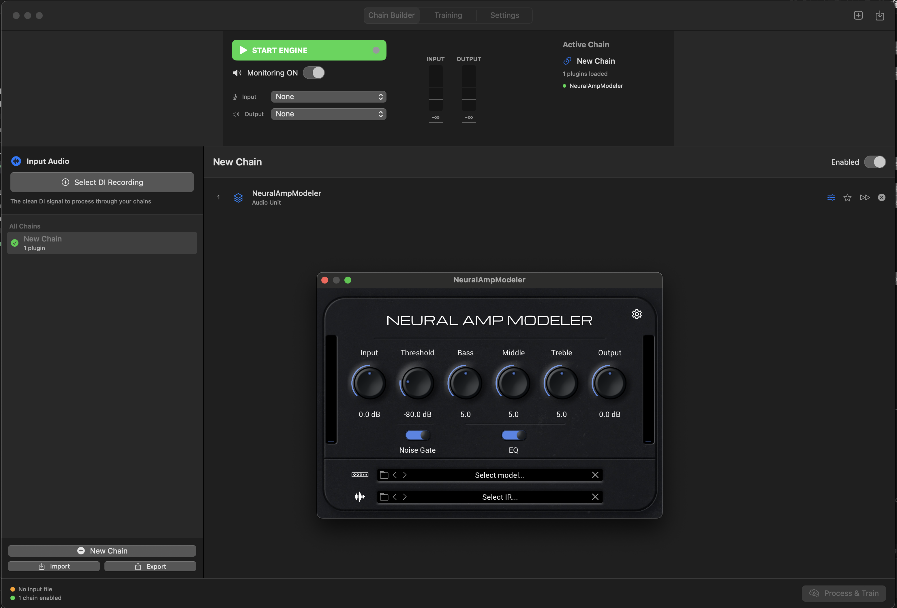
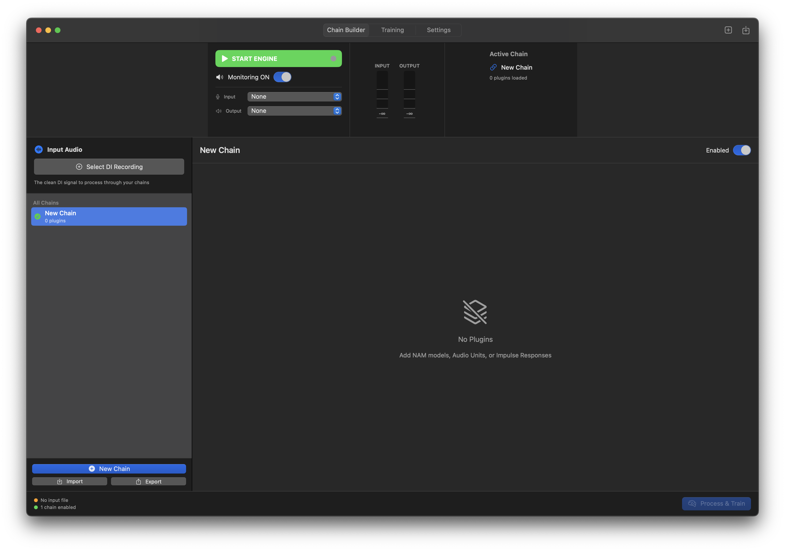
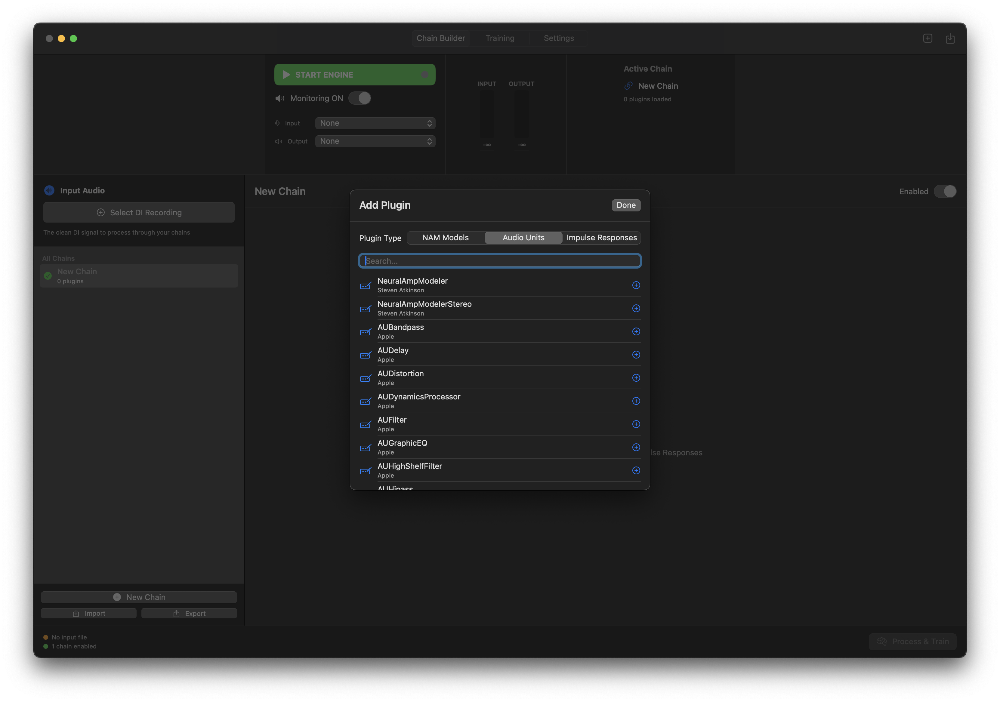
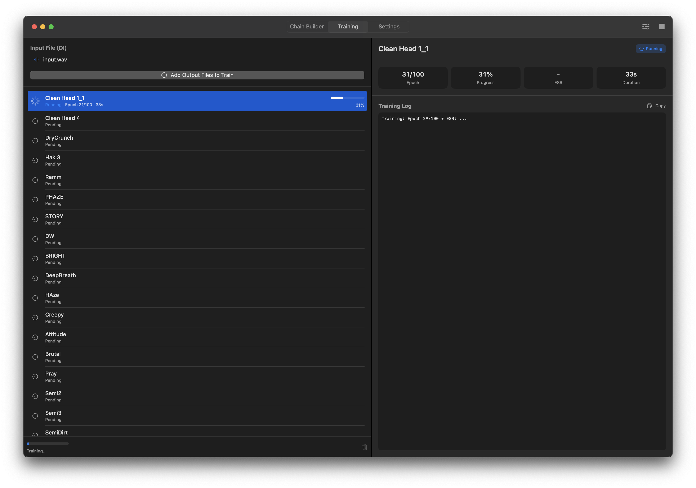

# NAM Reamp Lab 🎸

A powerful macOS companion for **Neural Amp Modeler (NAM)**. Streamline your workflow by building complex processing chains, batch reamping audio, and training neural models—all in one place.

[](https://www.apple.com/macos/)
[](https://swift.org)
[](LICENSE)



---

## ❤️ Credits & Attribution

This project is built upon the incredible work of **Steven Atkinson (@sdatkinson)**, the creator of **Neural Amp Modeler (NAM)**. 

**NAM Reamp Lab** uses the open-source `neural-amp-modeler` Python package for its training backend. We are deeply grateful to Steve and the NAM community for making high-quality neural modeling accessible to everyone.

*   [Neural Amp Modeler Repository](https://github.com/sdatkinson/neural-amp-modeler)
*   [NAM Plugin (AU/VST)](https://github.com/sdatkinson/NeuralAmpModelerPlugin)

---

## 🌟 Overview

NAM Reamp Lab is designed for tone creators who want to capture their perfect "digital" signal chains into portable NAM models. Whether you're stacking a boutique overdrive into a legendary amp sim and an IR-based cab, NAM Reamp Lab automates the tedious parts of the process.

1.  **Build** - Stack any AU plugins (pedals, amps, cabs) in custom chains.
2.  **Toggle** - Select which chains to include in your batch process with a single click.
3.  **Process** - Reamp your DI signal through all selected chains automatically.
4.  **Train** - Launch batch training jobs using the high-performance WaveNet architecture.

## ✨ Key Features

### 🛠️ Professional Chain Builder

- **Universal AU Support**: Use any 3rd-party Audio Unit plugins (amp sims, delays, compressors).

- **Interactive Toggles**: Mark specific chains for batch processing directly in the sidebar.
- **Deep Preset Management**: Plugin states are captured automatically during reamping.
- **Real-time Monitoring**: High-performance audio engine with low latency.

### 🧠 Seamless Training Workflow

- **One-Click Batching**: "Process & Train" takes you from raw audio to a training queue instantly.
- **GPU Accelerated**: Native support for Apple Silicon (M1/M2/M3) via Metal (MPS).
- **Quality Analysis**: Real-time ESR tracking with color-coded quality bands.
- **Automated Export**: Models are named and saved to your library automatically.

### 🎛️ Advanced Audio I/O
- **Multi-Channel Support**: Selective input channel routing for professional interfaces.
- **Visual Feedback**: Precise RMS metering with vDSP acceleration.
- **Stable Switching**: Atomic device configuration to prevent CoreAudio crashes.

## 🚀 Getting Started

### Requirements
- **macOS 15.0+**
- **Python 3.10** (specifically 3.10 for stable MPS support)
- [NAM Audio Unit Plugin](https://github.com/sdatkinson/NeuralAmpModelerPlugin) (highly recommended)

### Installation

1.  **Clone the Repo**
    ```bash
    git clone https://github.com/profmitchell/NAM-Reamp-Lab.git
    cd NAM-Reamp-Lab
    ```

2.  **Set up Python Environment**
    We recommend using a dedicated virtual environment:
    ```bash
    python3.10 -m venv .venv
    source .venv/bin/activate
    pip install torch torchvision torchaudio
    pip install neural-amp-modeler
    ```

3.  **Open in Xcode**
    ```bash
    open "NAM Reamp Lab.xcodeproj"
    ```

## 🏗️ Technical Architecture

### Core Components
- **AudioEngine**: A modular wrapper around `AVAudioEngine`, handling real-time routing and offline rendering.
- **NAMTrainer**: Manages detached Python subprocesses for training, ensuring the UI remains responsive.
- **ChainManager**: Oversees persistent storage and deep-copying of plugin states.

### Modular Backend
The engine is divided into specialized extensions:
- `AudioEngine+Plugins`: Complex AU/NAM state management.
- `AudioEngine+Metering`: High-performance vDSP-based RMS calculation.
- `AudioEngine+Devices`: Robust hardware discovery and mapping.

## 📄 License

Distributed under the **MIT License**. See `LICENSE` for more information.

## 🤝 Contributing

We welcome contributions! Please feel free to open issues or submit pull requests to help improve the NAM ecosystem.

---

Made by Mitchell Cohen in collaboration with the NAM Community.
